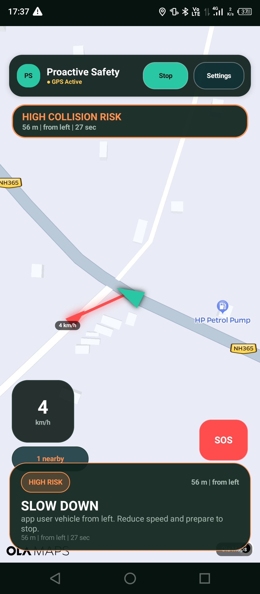
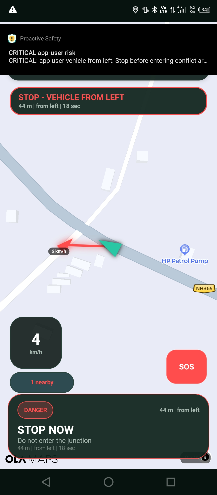

# Intelligent Proactive Road, Travel and Emergency Safety Platform

AI-driven proactive road safety platform that detects potential collision risks and provides real-time warnings to road users.

## About

The **Intelligent Proactive Road, Travel and Emergency Safety Platform** is designed to improve road safety by identifying potential hazards before they become accidents.

The platform combines location awareness, risk analysis, road-risk zones, and cooperative vehicle information to provide timely warnings and help road users take preventive action.

## Problem

Road accidents can occur when drivers or riders have limited visibility, insufficient reaction time, or difficulty judging the speed and distance of approaching vehicles.

Traditional safety systems often focus on responding after an accident. This project focuses on **proactive prevention** by detecting potential risks and warning users early.

## Solution

The platform continuously evaluates available safety information and identifies situations that may lead to a collision.

**Hazard Detection → Risk Analysis → Early Warning → User Reaction → Potential Accident Prevention**

Warnings can be presented through the application using visual alerts and safety instructions such as:

- Slow down
- Stop immediately
- Vehicle approaching
- High collision risk
- High-risk junction ahead

## Key Features

- Real-time location-based safety monitoring
- Collision-risk detection
- Risk-zone awareness
- Cooperative vehicle conflict detection
- Early visual safety warnings
- Critical vehicle approach alerts
- Safety-focused map interface
- Emergency/SOS functionality
- Web-based safety monitoring and risk-zone management
- Automated risk-engine tests

## How It Works

1. The application obtains the user's current location.
2. The system evaluates nearby risk zones and available vehicle information.
3. The risk engine analyses factors such as distance, direction, closing speed, and known road risk.
4. A risk level is determined.
5. The user receives an appropriate warning.
6. The warning gives the road user time to slow down, stop, or take preventive action.

## Risk Detection

The system uses a risk-analysis approach to classify potentially dangerous situations.

Risk assessment can consider:

- Distance between road users
- Relative movement and direction
- Closing speed
- Known high-risk locations
- Junction characteristics
- Visibility conditions
- Available reaction time

The resulting risk level can trigger different warning states, from normal monitoring to high or critical collision warnings.

## Cooperative Safety

The platform includes a cooperative safety mechanism in which participating vehicles can exchange relevant location and movement information.

This allows the system to identify potential conflicts between participating road users and generate proactive warnings.

> **Current limitation:** A smartphone cannot reliably determine the speed or movement of an unrelated vehicle that is not participating in the system. Cooperative vehicle detection therefore depends on participating devices or available data sources.

## Application Screenshots

### High Collision Risk

The application identifies a high collision risk and provides a clear **SLOW DOWN** warning.



### Critical Vehicle Warning

The application provides an immediate warning when a vehicle conflict reaches a critical state.



> Additional working-application screenshots can be added to this section as the platform evolves.

## Technology Stack

### Android Application

- Java
- Android SDK
- GPS / Location Services
- WebView-based map integration

### Web Platform & Backend

- Node.js
- JavaScript
- HTML
- CSS
- WebSocket communication
- JSON-based risk-zone data

### Testing

- Node.js test scripts
- Risk-engine testing
- Cooperative-engine testing

## Project Structure

```text
proactive-safety-platform/
├── android-app/        # Android safety application
├── data/               # Risk-zone data
├── design/             # UI and design assets
├── dist/               # Deployment-related server build
├── docs/               # Documentation and presentation
├── lib/                # Core safety engines
├── public/             # Web application
├── tests/              # Automated tests
├── .gitignore
├── CLOUD_DEPLOY.md
├── Procfile
├── package.json
├── render.yaml
├── server.js
└── README.md
```

## Running the Web Platform

Install the project dependencies:

```bash
npm install
```

Start the backend:

```bash
npm start
```

Run the automated tests:

```bash
npm test
```

## Current Status

The project currently contains an Android application, web platform, backend services, risk-analysis components, cooperative safety functionality, sample risk-zone data, and automated tests.

The platform is a **prototype / development project** intended to demonstrate the concept of proactive road safety and collision-risk prevention.

## Future Scope

- Integration with larger real-world road-risk datasets
- Improved AI-based risk prediction
- Integration with additional vehicle and traffic data sources
- Advanced navigation and route-risk analysis
- Improved emergency-response integration
- Wider cooperative vehicle participation
- Field testing and real-world validation
- Expansion to additional road and travel safety scenarios
